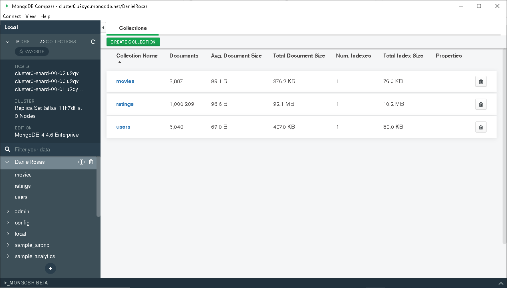

# Descripción
Autor : José Daniel Rosas Avila

En esta carpeta se encuentran los archivos .sql los cuales contienen los comandos de los retos y ejercicios de la clase 4.

Nota: En caso de tener que describirse algo, se mostrará debajo de esta descripción.

# Reto 2 
Para la parte de importacion de datos del reto 2, se utilizó el *import Wizard* de *MySQL* para las 3 tablas generadas


# Reto 3 
1. Crear la colección`movies`
2. Importar datos a la colección `movies` desde el archivo `movies.csv`
3. Crear la colección `ratings`
4. Importar datos a la colección `ratings` desde el archivo `ratings.csv`




# Ejercicios

1. Agregar los siguientes registros en formato CSV a la Colección `movies`

   ```csv
   4000,Avengers: Endgame (2019),Fantasy|Sci-Fi
   4001,Glass (2019),Drama|Fantasy
   ```


2. Modificar el documento con `id=4001` en la Colección `movies` para que contenga la siguiente información:

   ```json
   {
     id:"4001",
     titulo:"Glass (2019)",
     genres:"Drama|Fantasy",
     valoraciones: [
       {
         userid: "1563",
         movieid: "4001",
         rating: "4"
       },
       {
         userid: "434",
         movieid: "4001",
         rating: "5"
       }
     ]
   }
   ```
   