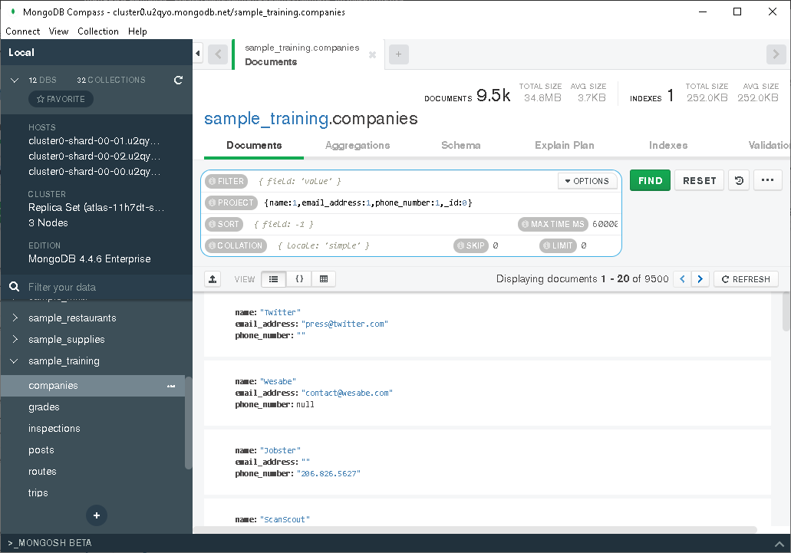

# Descripción
Autor : José Daniel Rosas Avila

En este archivo se encuentran las evidencias de los retos y ejercicios de la clase 5.

# Reto 1
Usando la base de datos `sample_mflix`, proyecta los datos que se solicitan.

- Fecha, nombre y texto de cada comentario.

- Título, elenco y año de cada película.

- Nombre y contraseña de cada usuario.

# Reto 2
Usando la base de datos `sample_mflix`, agrega proyeccciones, filtros, ordenamientos y límites que permitan contestar las siguientes preguntas:

- ¿Qué comentarios ha hecho Greg Powell?

- ¿Qué comentarios han hecho Greg Powell o Mercedes Tyler?

- ¿Cuál es el máximo número de comentarios en una película?

- ¿Cuál es título de las cinco películas más comentadas?

# Ejercicios 

1. Obtén los datos de contacto de cada compañía.

2. Obtén el identificador de la clase de cada calificación.

3. Obtén el nombre de todas las compañias fundadas en octubre.

4. Obtén el nombre de todas las compañías fundadas en 2008.

5. Obtén todos los *post* del autor `machine`.

6. Obtén todas las calificaciones provenientes de los grupos `357`, `57` y `465`.

7. Obtén todas las compañías fundadas en octubre del 2008.

8. Obtén todas las compañias con más de 50 empleados. 

9. Obtén las rutas con un número de paradas entre 1 y 5.

10. Obtén la empresa con el menor número de empleados.

11. Obtén la empresa con el mayor número de empleados.

12. Obtén el viaje con mayor duración.

13. Obtén el viaje con menor duración.

