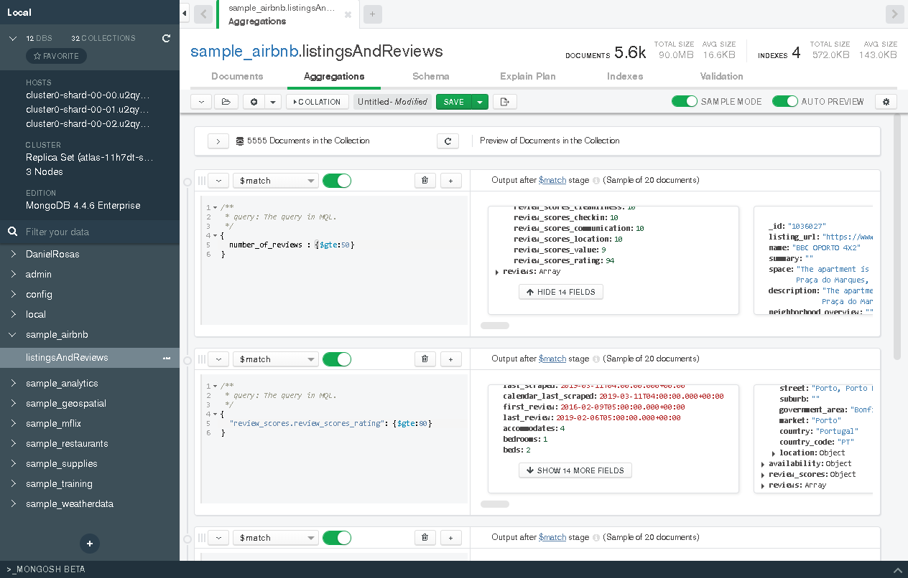

# Descripción
Autor : José Daniel Rosas Avila

En este archivo se encuentran las evidencias de los retos y ejercicios de la clase 6.


# Reto 1

Usando la base de datos `sample_airbnblistingsAndReviews`, realiza los siguientes filtros:

- Propiedades que no permitan fiestas.


- Propiedades que admitan mascotas.


- Propiedades que no permitan fumadores.


- Propiedades que no permitan fiestas ni fumadores.


# Reto 2 

Usando la colección `sample_airbnb.listingsAndReviews`, agrega un filtro que permita obtener todas las publicaciones que tengan 50 o más comentarios, que la valoración sea mayor o igual a 80, que cuenten con conexión a Internet vía cable y estén ubicada en Brazil.

Esto se logra con la siguiente sentencia:
```json
{number_of_reviews:{$gte:50},
"review_scores.review_scores_rating":{$gte:80},
amenities:/ethernet/i,
"address.country_code":"BR"}
```


# Reto 3
Usando la colección `sample_airbnb.listingsAndReviews`, mediante el uso de agregaciones, encontrar el número de publicaciones que tienen conexión a Internet, sea desde Wifi o desde cable (Ethernet).


# Ejercicios

La base de datos y colección que debes usar es `sample_airbnb.listingsAndReviews`.

El ejercicio consiste en obtener todas las publicaciones que tengan 50 o más comentarios, que la valoración sea mayor o igual a 80, que cuenten con conexión a Internet vía cable y estén ubicadas en Brazil.


